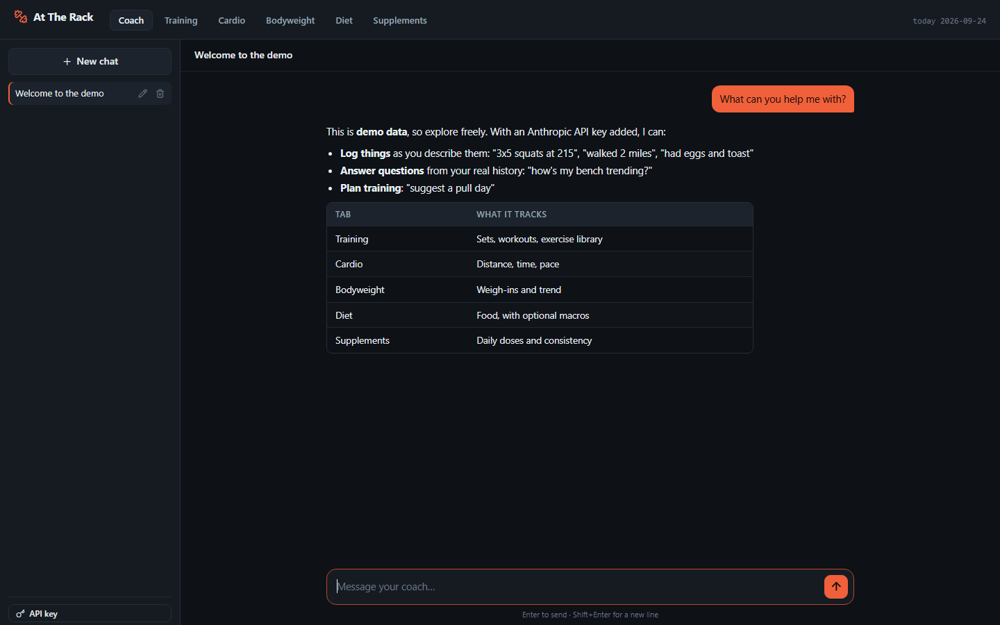
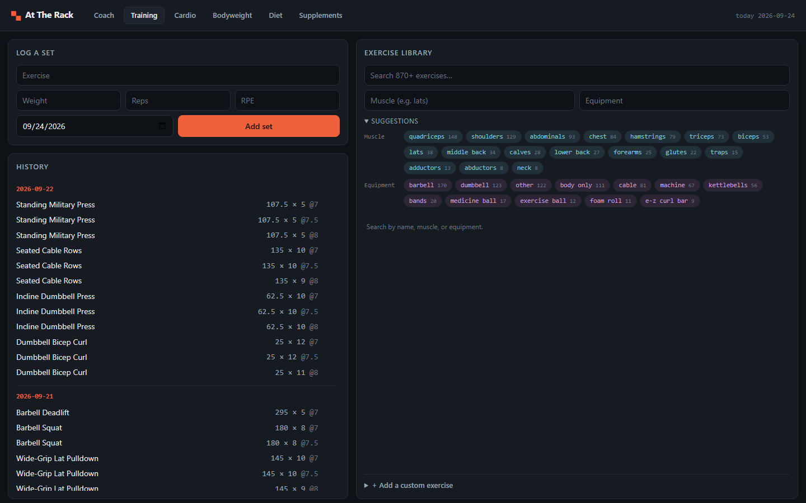
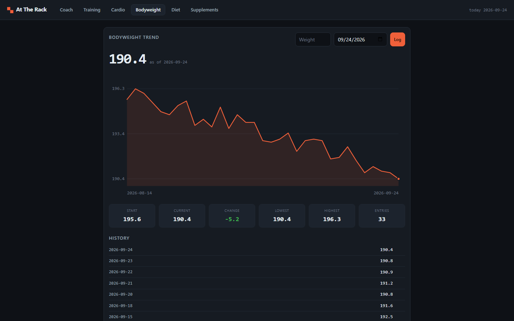
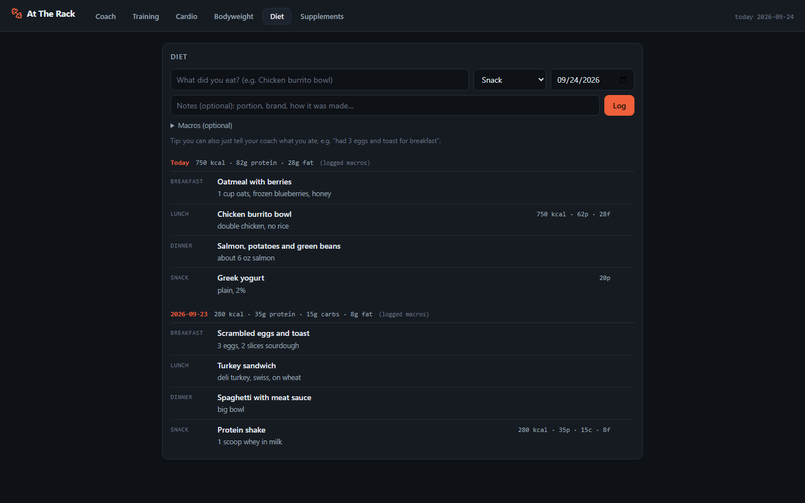
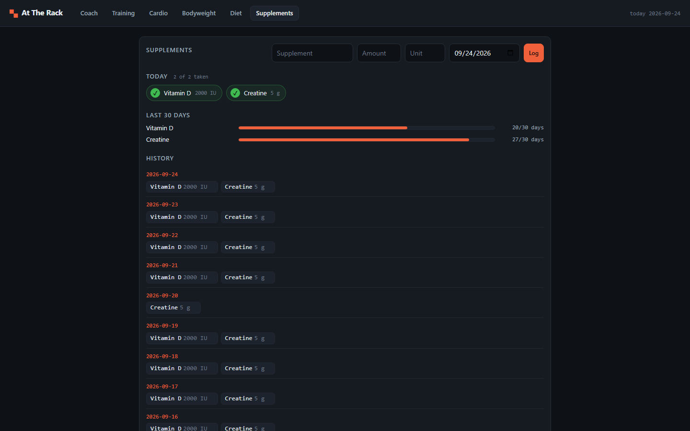

# At The Rack

A lightweight, self-hosted training tracker with a built-in AI coach. It
tracks lifting, cardio, bodyweight, diet and supplements. Talk to the coach
the way you'd text a friend ("did 3x5 squats at 225", "had eggs and toast for
breakfast", "how's my bench trending?") and it logs things for you and answers
from your real history.

One Go binary: no Node, no frontend build step, no external services except the
optional Anthropic API. Data lives in a local SQLite file.



<table>
  <tr>
    <td></td>
    <td></td>
  </tr>
  <tr>
    <td></td>
    <td></td>
  </tr>
</table>

*Screenshots use the built-in demo data (`-seed-demo`).*

## Features

| Tab | What it does |
| --- | --- |
| **Coach** (home) | Chat with Claude, organized into conversations like the Claude app: a sidebar of threads, automatic titles, rename and delete. The coach reads and writes all of your data through tools, so answers use real numbers. Attach, paste or drop photos (up to 4 per message) to ask about a machine you don't recognize, a physique check-in, a meal, or a screenshot of a plan. |
| **Training** | Log sets (exercise, weight, reps, RPE); they're grouped into dated workouts. Search a library of ~870 exercises by name, muscle or equipment, or add your own (the **AI** button fills in muscles and equipment from the name). Click any exercise for its history: best set, estimated 1RM, progression chart, every set by date. |
| **Cardio** | Log sessions (type, minutes, miles) with weekly and 30-day totals. Click a type (e.g. Running) for its history: distance, time, pace and speed per session, plus best and average pace and a pace chart. |
| **Bodyweight** | Weigh-ins with a trend chart and start/current/change/min/max stats. |
| **Progress** | Track body measurements (waist, chest, hips, neck, arms, thighs, calves) with a per-site trend chart, and keep a dated gallery of progress photos. |
| **Diet** | Log what you ate. A name is enough; notes (portion, brand) and macros (calories, protein, carbs, fat) are optional. Days show macro totals when you've entered them. |
| **Supplements** | Log doses. Everything you've taken before becomes a one-click button for today, with a 30-day consistency bar for each. |

## Quick start

Requires [Go 1.25+](https://go.dev/dl/).

```sh
git clone https://github.com/jwald3/attherack && cd attherack

# Try it with fake data first (writes demo.db, leaves your real data alone):
go run . -seed-demo -db demo.db

# Or start fresh with your own data:
go run .
```

Then open <http://localhost:8080>.

To turn on the coach, click **API key** at the bottom of the Coach sidebar
and paste an Anthropic API key (get one at
[console.anthropic.com](https://console.anthropic.com)). It's saved in your
local database and takes effect immediately. Everything except the coach and
the **AI** button works without a key.

To build a standalone binary:

```sh
go build -o attherack .
./attherack
```

## Configuration

Set these as environment variables, or copy `.env.example` to `.env` (the app
reads it on startup; real environment variables take priority).

| Variable | Default | Purpose |
| --- | --- | --- |
| `ANTHROPIC_API_KEY` | *(unset)* | Enables the coach. If set, it overrides any key saved in the app, and the in-app key field becomes read-only. |
| `ADDR` | `127.0.0.1:8080` | Listen address. The default only accepts connections from this computer. |
| `DB_PATH` | `attherack.db` | SQLite file, created on first run. The `-db` flag overrides it. |
| `ANTHROPIC_BASE_URL` | `https://api.anthropic.com` | Where the coach sends API requests. Only needed for a proxy or the end-to-end tests' fake API. |

> **Security:** there is no login. Anyone who can reach the port can read your
> data and use your saved API key. To use the app from your phone, set
> `ADDR=:8080` only on a network you trust, or put it behind a VPN such as
> Tailscale, or behind a reverse proxy that adds authentication.

### Command-line flags

| Flag | Purpose |
| --- | --- |
| `-db FILE` | Database file to use (overrides `DB_PATH`). |
| `-seed-demo` | Fill an **empty** database with about six weeks of fake data, then start. Refuses if the database already has data. |
| `-import-exercises FILE` | Import custom exercises from a ChimpFitness exercises CSV export. |
| `-import-workouts FILE` | Import sets from a ChimpFitness workouts CSV export. |
| `-import-bodyweight FILE` | Import only the `body_weight` column from a ChimpFitness workouts CSV. Safe to re-run. |
| `-migrate-cardio FILE` | Move cardio rows from a ChimpFitness workouts CSV into the Cardio tab. Safe to re-run. |
| `-import-only` | Exit after running the imports above instead of starting the server. |

## How the coach works

Each message runs a standard Anthropic tool-use loop
([`internal/coach`](internal/coach)) using `claude-opus-4-8`. The coach has these tools,
all backed by your local SQLite database:

| Area | Read | Write |
| --- | --- | --- |
| Training | `list_workouts`, `get_exercise_history`, `search_exercises` | `log_set`, `set_workout_notes`, `create_exercise` |
| Cardio | `get_cardio_history` | `log_cardio` |
| Bodyweight | `get_bodyweight_history` | `log_bodyweight` |
| Measurements | `get_measurement_history` | `log_measurement` |
| Programs | `list_programs` | `create_program`, `start_program` |
| Diet | `get_food_history` | `log_food` |
| Supplements | `get_supplement_history` | `log_supplement` |

A short snapshot of recent activity (last few workouts, this week's cardio,
latest weigh-in and body measurements, today's food and supplements) is added
to the system prompt, so the coach has context before it calls any tool.

The cheaper `claude-haiku-4-5` model writes conversation titles and powers the
**AI** button on the custom-exercise form.

Photos are downscaled in the browser (longest edge 1568px) before upload and
stored in the local database alongside the message, so earlier photos in a
conversation stay in context for follow-up questions.

Your API key stays on your machine. The only data that leaves it is what's
sent to the Anthropic API during a chat: your messages and any photos you
attach, plus whatever the coach's tools read to answer them.

## Project layout

`main.go` only reads flags and config and wires the pieces together; the app
itself lives in `internal/`, one package per concern. Dependencies point one
way: `server` and `coach` use `store` and `exercise`, never the reverse.

```
main.go               entry point: flags, imports/seed, start the server
internal/
  config/             environment and .env loading
  store/              SQLite schema, migrations and queries, one file per domain
  exercise/           embedded exercise library (exercises.json) and search
  coach/              Anthropic API client, the tool-use loop, and the coach's
                      tools (tools_*.go, grouped by domain)
  server/             HTTP routes and handlers, one file per tab
  chart/              server-rendered SVG line charts
  markdown/           small, safe Markdown renderer for coach replies (incl. tables)
  importer/           ChimpFitness CSV importers
  seed/               -seed-demo fake data
  dates/              YYYY-MM-DD date helpers
web/
  assets.go           embeds the two folders below into the binary
  templates/          one template per page (coach, training, cardio, ...)
  static/             style.css, app.js, vendored htmx.min.js
e2e/                  browser end-to-end tests (Playwright) with a fake Claude API
docs/screenshots/     README images (captured from -seed-demo data)
```

Unit tests sit next to the code they test (`go test ./...`).

Templates and static files are compiled into the binary with `go:embed`, so
restart (or re-run `go run .`) after editing them.

## Development

```sh
go run . -seed-demo -db dev.db   # first run: create a dev database with fake data
go run . -db dev.db              # later runs: reuse it
go test ./...                    # run unit tests
go vet ./... && gofmt -l .       # lint; gofmt should print nothing
```

### End-to-end tests

`e2e/` drives the real app in a headless browser with
[Playwright](https://playwright.dev). It builds the Go binary, starts it
against a throwaway database, and points it at `e2e/fake-claude.mjs`, a
stand-in for the Anthropic API that records what the app sends and replies
deterministically, so the tests need no key and make no network calls. They
cover the photo flow end to end: attaching, pasting, in-browser downscaling,
the image blocks in the outgoing API request, thumbnails after reload, and
rejected uploads.

```sh
cd e2e
npm install && npx playwright install chromium   # once
npm test                                         # headless run
npm run test:ui                                  # Playwright's interactive runner
```

The stack is intentionally small: Go standard library `net/http` and
`html/template`, [HTMX](https://htmx.org) for interactivity, and
[modernc.org/sqlite](https://pkg.go.dev/modernc.org/sqlite) (pure Go, no C
compiler needed). There is no JavaScript build step. `web/static/app.js` is
plain JS.

Database files (`*.db`, backups, WAL files) are git-ignored because they hold
your personal data and possibly your API key. Don't commit them.

## License

MIT, see [`LICENSE`](LICENSE). Exercise data comes from
[free-exercise-db](https://github.com/yuhonas/free-exercise-db), also MIT.
