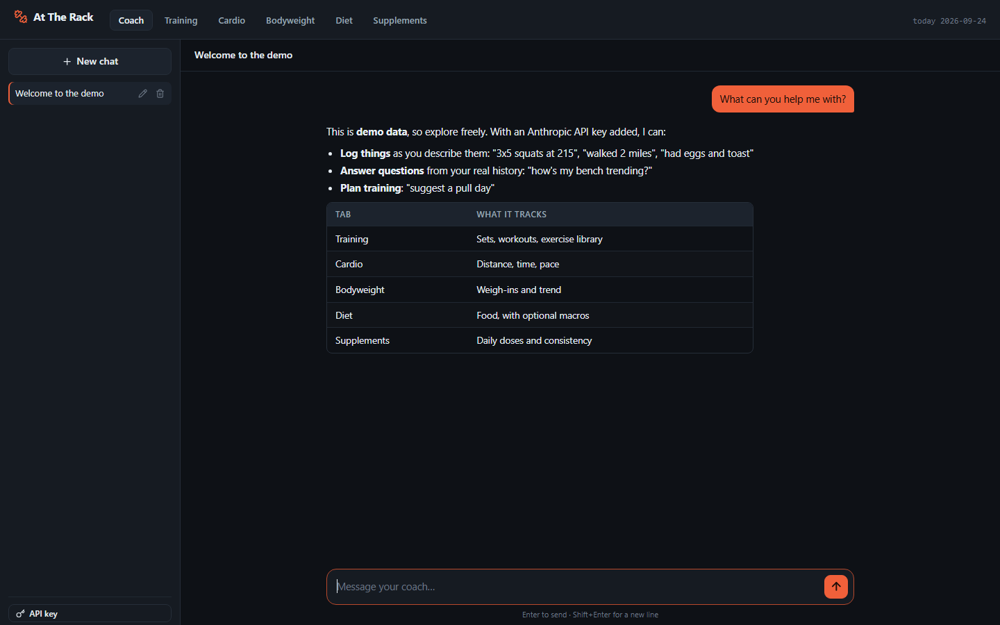
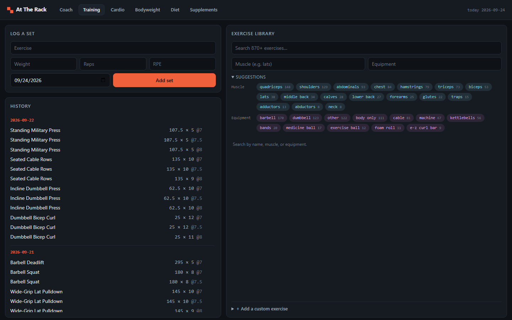
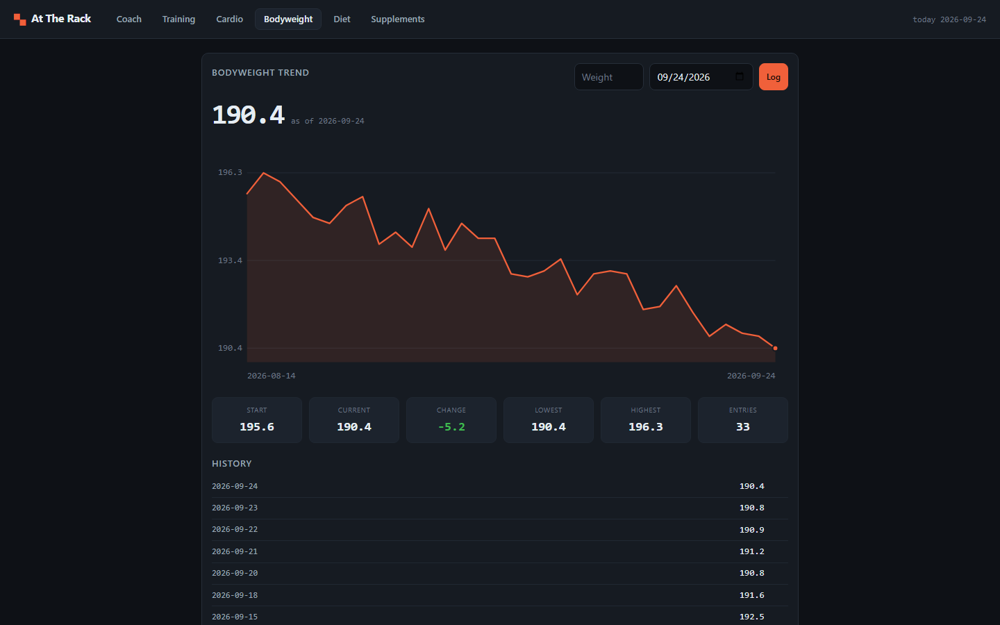
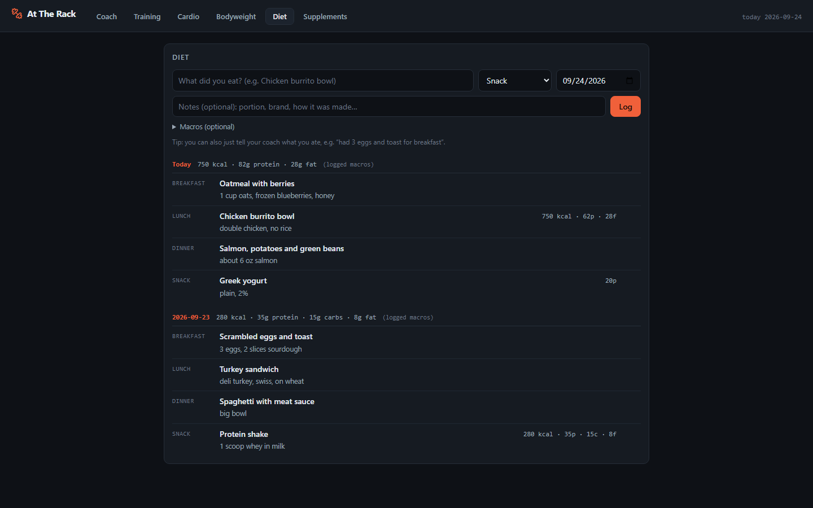
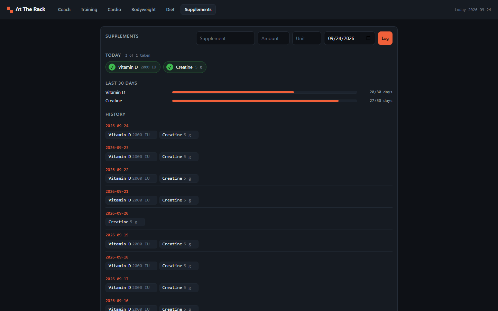

# At The Rack

At The Rack allows you to track fitness data in a single application equipped with an AI chatbot that can readily query any of the information you’ve given it to provide specific, tailored advice and feedback. The app uses your training, diet, supplements, and progress data as context for all conversations, making it a powerful wrapper built around the latest Claude model. 



<table>
  <tr>
    <td></td>
    <td></td>
  </tr>
  <tr>
    <td></td>
    <td></td>
  </tr>
</table>

*Screenshots use the built-in demo data (`-seed-demo`).*

## Features

| Tab | What it does |
| --- | --- |
| **Coach** (home) | A specialized harness around Claude with access to all the app’s data and functionality. You can use the Coach to ask about data you’ve provided and even use it to enter new data using conversational language. The Coach has full read and write permissions, meaning you can use this as your one-stop interface for interacting with At The Rack. Ask it questions, and you’ll be surprised how much it knows. |
| **Training** | Manually log sets of exercises using a library of hundreds of different options. You can add context to the set, giving the Coach more information to use in subsequent conversations.  |
| **Cardio** | Manually track cardio sessions and see history by each exercise type.  |
| **Bodyweight** | Monitor periodic weigh-ins using a convenient chart. |
| **Progress** | Track gym progress using body-specific measurements and photos. |
| **Diet** | Log what you eat and optionally add details like which meal it was part of and its estimated macros.  |
| **Supplements** | Log any supplements taken as part of your regimen.  |

## Quick start

Requires [Go 1.25+](https://go.dev/dl/).

```sh
git clone https://github.com/jwald3/attherack && cd attherack

# Try it with fake data first (writes demo.db, leaves your real data alone):
go run . -seed-demo -db demo.db

# Or start fresh with your own data:
go run .
```

Then open <http://localhost:8080>.

To turn on the coach, click **API key** at the bottom of the Coach sidebar
and paste an Anthropic API key (get one at
[console.anthropic.com](https://console.anthropic.com)). It's saved in your
local database and takes effect immediately. Everything except the coach and
the **AI** button works without a key.

To build a standalone binary:

```sh
go build -o attherack .
./attherack
```

## Configuration

Set these as environment variables, or copy `.env.example` to `.env` (the app
reads it on startup; real environment variables take priority).

| Variable | Default | Purpose |
| --- | --- | --- |
| `ANTHROPIC_API_KEY` | *(unset)* | Enables the coach. If set, it overrides any key saved in the app, and the in-app key field becomes read-only. |
| `ADDR` | `127.0.0.1:8080` | Listen address. The default only accepts connections from this computer. |
| `DB_PATH` | `attherack.db` | SQLite file, created on first run. The `-db` flag overrides it. |
| `ANTHROPIC_BASE_URL` | `https://api.anthropic.com` | Where the coach sends API requests. Only needed for a proxy or the end-to-end tests' fake API. |

> **Security:** there is no login. Anyone who can reach the port can read your
> data and use your saved API key. To use the app from your phone, set
> `ADDR=:8080` only on a network you trust, or put it behind a VPN such as
> Tailscale, or behind a reverse proxy that adds authentication.

### Command-line flags

| Flag | Purpose |
| --- | --- |
| `-db FILE` | Database file to use (overrides `DB_PATH`). |
| `-seed-demo` | Fill an **empty** database with about six weeks of fake data, then start. Refuses if the database already has data. |
| `-import-exercises FILE` | Import custom exercises from a ChimpFitness exercises CSV export. |
| `-import-workouts FILE` | Import sets from a ChimpFitness workouts CSV export. |
| `-import-bodyweight FILE` | Import only the `body_weight` column from a ChimpFitness workouts CSV. Safe to re-run. |
| `-migrate-cardio FILE` | Move cardio rows from a ChimpFitness workouts CSV into the Cardio tab. Safe to re-run. |
| `-import-only` | Exit after running the imports above instead of starting the server. |

## How the coach works

Each message runs a standard Anthropic tool-use loop
([`internal/coach`](internal/coach)) using `claude-opus-4-8`. The coach has these tools,
all backed by your local SQLite database:

| Area | Read | Write |
| --- | --- | --- |
| Training | `list_workouts`, `get_exercise_history`, `search_exercises` | `log_set`, `set_workout_notes`, `create_exercise` |
| Cardio | `get_cardio_history` | `log_cardio` |
| Bodyweight | `get_bodyweight_history` | `log_bodyweight` |
| Measurements | `get_measurement_history` | `log_measurement` |
| Programs | `list_programs` | `create_program`, `start_program` |
| Diet | `get_food_history` | `log_food` |
| Supplements | `get_supplement_history` | `log_supplement` |

A short snapshot of recent activity (last few workouts, this week's cardio,
latest weigh-in and body measurements, today's food and supplements) is added
to the system prompt, so the coach has context before it calls any tool.

The cheaper `claude-haiku-4-5` model writes conversation titles and powers the
**AI** button on the custom-exercise form.

Photos are downscaled in the browser (longest edge 1568px) before upload and
stored in the local database alongside the message, so earlier photos in a
conversation stay in context for follow-up questions.

Your API key stays on your machine. The only data that leaves it is what's
sent to the Anthropic API during a chat: your messages and any photos you
attach, plus whatever the coach's tools read to answer them.

## Project layout

`main.go` only reads flags and config and wires the pieces together; the app
itself lives in `internal/`, one package per concern. Dependencies point one
way: `server` and `coach` use `store` and `exercise`, never the reverse.

```
main.go               entry point: flags, imports/seed, start the server
internal/
  config/             environment and .env loading
  store/              SQLite schema, migrations and queries, one file per domain
  exercise/           embedded exercise library (exercises.json) and search
  coach/              Anthropic API client, the tool-use loop, and the coach's
                      tools (tools_*.go, grouped by domain)
  server/             HTTP routes and handlers, one file per tab
  chart/              server-rendered SVG line charts
  markdown/           small, safe Markdown renderer for coach replies (incl. tables)
  importer/           ChimpFitness CSV importers
  seed/               -seed-demo fake data
  dates/              YYYY-MM-DD date helpers
web/
  assets.go           embeds the two folders below into the binary
  templates/          one template per page (coach, training, cardio, ...)
  static/             style.css, app.js, vendored htmx.min.js
e2e/                  browser end-to-end tests (Playwright) with a fake Claude API
docs/screenshots/     README images (captured from -seed-demo data)
```

Unit tests sit next to the code they test (`go test ./...`).

Templates and static files are compiled into the binary with `go:embed`, so
restart (or re-run `go run .`) after editing them.

## Development

```sh
go run . -seed-demo -db dev.db   # first run: create a dev database with fake data
go run . -db dev.db              # later runs: reuse it
go test ./...                    # run unit tests
go vet ./... && gofmt -l .       # lint; gofmt should print nothing
```

### End-to-end tests

`e2e/` drives the real app in a headless browser with
[Playwright](https://playwright.dev). It builds the Go binary, starts three
instances against throwaway databases (one with an API key, one without, and
one filled with `-seed-demo` data), and points them at `e2e/fake-claude.mjs`, a stand-in for the Anthropic API that
records what the app sends and replies deterministically, so the tests need no
key and make no network calls.

The tests cover every tab: logging and deleting on each, the exercise library
and history drawers, programs, charts, progress photos, and the API-key
settings. On the coach side they cover threads, titles, photos, and every
coach tool. They also check HTML escaping of user-entered text, accessible
names on every control, and a phone-sized layout (a separate `mobile`
project). A message can script the fake API with directives: `<<tool:log_set
{"exercise":"Squat","weight":225,"reps":5}>>` makes it call a tool,
`<<error 529 Overloaded>>` makes it fail, and `<<slow 2500>>` delays the reply.
Tests share one database per run, so each one uses unique names (`uid()`) or
dates (`randomYear()`).

```sh
cd e2e
npm install && npx playwright install chromium   # once
npm test                                         # headless run
npm run test:ui                                  # Playwright's interactive runner
```

The stack is intentionally small: Go standard library `net/http` and
`html/template`, [HTMX](https://htmx.org) for interactivity, and
[modernc.org/sqlite](https://pkg.go.dev/modernc.org/sqlite) (pure Go, no C
compiler needed). There is no JavaScript build step. `web/static/app.js` is
plain JS.

Database files (`*.db`, backups, WAL files) are git-ignored because they hold
your personal data and possibly your API key. Don't commit them.

## Contributing

Bug reports, feature ideas, and pull requests are welcome — see
[`CONTRIBUTING.md`](CONTRIBUTING.md) for how to get set up and the checks to run
before opening a PR. Notable changes are recorded in
[`CHANGELOG.md`](CHANGELOG.md).

## License

MIT, see [`LICENSE`](LICENSE). Exercise data comes from
[free-exercise-db](https://github.com/yuhonas/free-exercise-db), also MIT.
